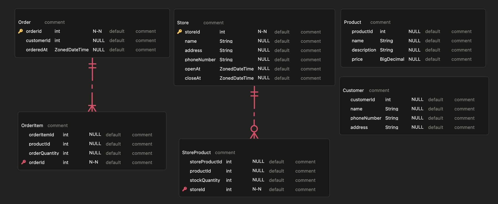

# プロジェクト目的
JavaSpringの基本の理解（JDBC、トランザクション、MVCモデル）

# 要件定義
特定の店舗から注文できる。  
注文書を作成時には、最低一つ以上の商品を選ぶ必要はある。  
在庫がなければ、注文できない。

## ドメイン

### 注文 (Order)
- 顧客は欲しい数量の商品を注文できる。
- 注文するときは特定の店舗を指定する必要がある。（在庫管理）
- 一つ以上の商品を注文するときは、オーダーを作成できる。

### 顧客 (Customer)
- 注文をするには会員登録されている顧客でなければならない。
- 会員は名前、住所、電話番号が必要である。

### 店舗 (Store)
- 店舗を登録できる。
- 店舗は店舗名、住所、電話番号、開店ー閉店が必要である。

## 商品 (Product)
- 商品を登録できる。
- 商品は商品名、商品説明、そして価格を登録しなければならない。

## 店舗別商品
- 各店舗には販売できる商品の数が決められている。
- 在庫をアップデートできる必要がある。
- 店舗に注文が入ると店舗で提供できる在庫が存在するか確認する。
    - 万が一注文の中で一つの商品でも品切れの場合は注文を取り消しする。
    - 注文ができれば店舗の在庫を調整する。

# ERD
